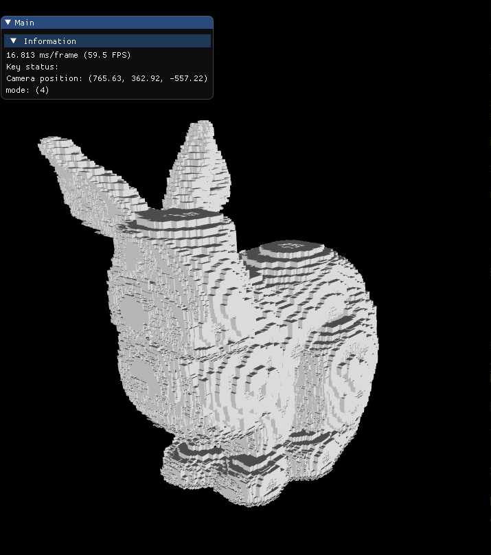
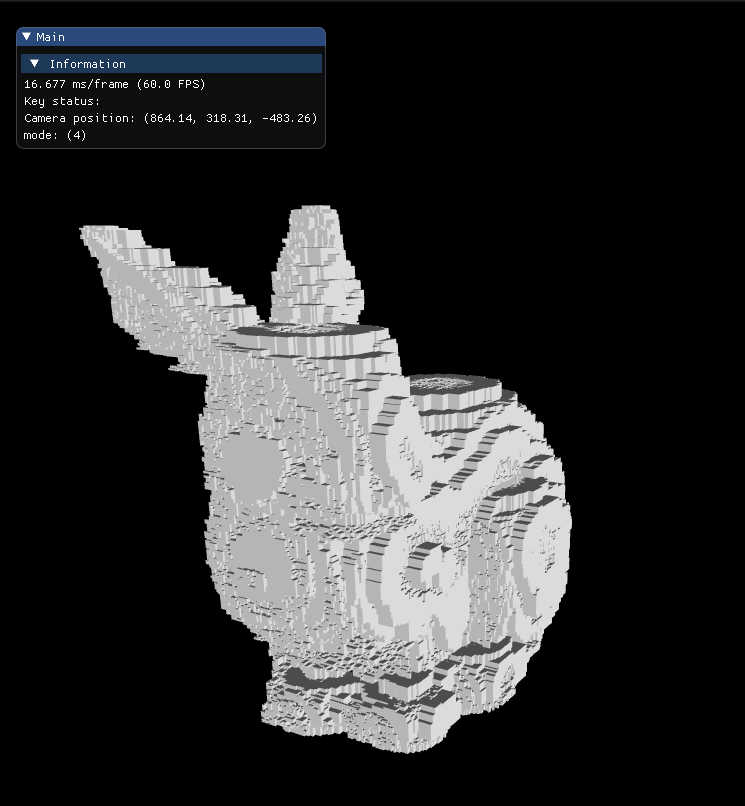

<!-- PROJECT LOGO --> <br /> <p align="center"> <a href="https://github.com/Talkative-Banana/3D-Mesh-Voxelizer">  </a>

<!-- ABOUT THE PROJECT -->
# 3D-Mesh-Voxelizer

A voxel, short for "volume element," is the three-dimensional equivalent of a pixel in 2D images. It represents a value on a grid in 3D space and is used in various fields such as computer graphics, medical imaging, and scientific visualization. Each voxel typically has a specific position and a value that represents some property of the space it occupies, such as color, density, or intensity.

In computer graphics, voxels are used to create 3D models and environments, offering advantages in representing complex structures and volumetric data that can be difficult to capture with traditional polygon-based models. In medical imaging, voxels are essential in technologies like CT scans and MRI, where they help create detailed 3D representations of the body's interior. In scientific visualization, voxels are used to model and analyze data in fields such as geology, meteorology, and fluid dynamics.


[](http://blog.wolfire.com/2009/11/Triangle-mesh-voxelization)

This Project explores a new way of voxelization as described in the paper [Real-time_voxelization_for_complex_polygonal_models](Real-time_voxelization_for_complex_polygonal_models.pdf).

<!-- BUILT WITH -->
### Built With
* Cpp
* [OpenGL](https://www.opengl.org/)
* [stb library](https://github.com/nothings/stb)


<!-- TABLE OF CONTENTS -->
### Table of Contents
<details open="open">
  <summary>Table of Contents</summary>
  <ol>
    <li>
      <a href="#about-the-project">About The Project</a>
      <ul>
        <li><a href="#built-with">Built With</a></li>
      </ul>
    </li>
    <li><a href="#documentation">Documentation</a></li>
    <li><a href="#results">Results</a></li>
    <li>
      <a href="#getting-started">Getting Started</a>
      <ul>
        <li><a href="#prerequisites">Prerequisites</a></li>
        <li><a href="#installation">Installation</a></li>
      </ul>
    </li>
    <li><a href="#contributing">Contributing</a></li>
    <li><a href="#contact">Contact</a></li>
    <li><a href="#acknowledgements">Acknowledgements</a></li>
  </ol>
</details>

<!-- DOCUMENTATION -->
## Documentation

### Main idea
The objective is to avoid projection problems in the rasterization stage performing three passes, each of those viewing the scene in front of one of each axis direction. The coordinate system will be placed at the center of the voxel grid, with their axis parallel to the grid edges.

### The method
This process describes a method for voxelizing a triangulated geometric model within its axis-aligned bounding box, using a 3D regular grid. Here’s a summary of the key steps and concepts:

**Bounding Box and Grid:** The model is placed in a bounding box with dimensions 𝑊×𝐻×𝐷 creating a grid of voxels. The box is split into slabs along the z-axis, each slab having a depth range of 32 (bits per texel).

[](http://blog.wolfire.com/2009/11/Triangle-mesh-voxelization)

**Slabs and Sheet Buffers:** Each slab can store 𝑊×𝐻×32 voxels. To fill the bounding box, 𝑁=⌈𝐷/32⌉ slabs are used, and all slabs are merged into a "sheet buffer" texture. This process is repeated for each of the three axis directions, resulting in three sheet buffers. A final "composed worksheet" texture is created from these buffers, representing the voxelized model.

**Voxelization Steps:** Rasterization: Determine which voxels intersect with each triangle and compute their 3D coordinates.

  * Texelization: Assign each voxel to the correct sheet buffer and texel, considering the offset within the texel.

  * Synthesis: Combine the three sheet buffers into the composed worksheet.

  * Preprocessing: To optimize the process, geometry is reordered into groups for each axis direction and for each slab. Triangles are sorted based on their projection and intersection with slabs.
    This sorting is done on the CPU before voxelization.

**Rendering:** Each axis group is rasterized slab by slab, adjusting clipping planes to slab boundaries. An orthogonal camera is suggested for accurate results. Bit storage in textures is handled using a lookup texture and alpha blending operations.

**Final Merge:** The three sheet buffers are merged into the composed worksheet, using the z-axis sheet buffer as a reference. This avoids repetition issues since each triangle is only in one axis group.

This method ensures efficient and accurate voxelization by traversing the model more or less once, with special handling for boundary triangles and voxel repetitions and use an orthogonal camera, gurantees linear distribution of depth.

<!-- RESULTS -->
## Results
[Stanford's Bunny Model](https://graphics.stanford.edu/data/3Dscanrep/), [Buddha Model]()

<a href="https://github.com/Talkative-Banana/3D-Mesh-Voxelizer">  </a>
<a href="https://github.com/Talkative-Banana/3D-Mesh-Voxelizer">  </a>
<a href="https://github.com/Talkative-Banana/3D-Mesh-Voxelizer">  </a>
<a href="https://github.com/Talkative-Banana/3D-Mesh-Voxelizer">  </a>
<a href="https://github.com/Talkative-Banana/3D-Mesh-Voxelizer">  </a>
<a href="https://github.com/Talkative-Banana/3D-Mesh-Voxelizer">  </a>

<!-- GETTING-STARTED -->
## Getting Started
To get a local copy up and running follow these simple steps.

<!-- PREREQUISITES -->
### Prerequisites
* Basic understanding of CPP
* OpenGL installed
* GitHub Account ([Sign Up](https://github.com/))

<!-- INSTALLATION -->
### Installation
* Clone the repo
  ```bash
  git clone https://github.com/Talkative-Banana/3D-Mesh-Voxelizer.git
  chmmod +x build.sh # (For linux users)
  ulimit -s unlimited
  ./build.sh
  ```
<!-- ROADMAP -->
## Roadmap
- Clone the repo and open it in suitable IDE for complete project source code. You can also fix the issues and hence contribute.

<!-- CONTRIBUTING -->
## Contributing
Contributions are what make the open source community such an amazing place to be learn, inspire, and create. Any contributions you make are greatly appreciated.

1. Fork the Project
2. Create your Feature Branch
3. Commit your Changes
4. Push to the Branch
5. Open a Pull Request
<!-- CONTACT -->
## Contact
Email ID - lakshay21059@iiitd.ac.in
<!-- ACKNOWLEDGEMENTS -->
## Acknowledgements
Lakshay Bansal lakshay21059@iiitd.ac.in

A learnt a lot from this cool website [Wolfire](http://blog.wolfire.com/2009/11/Triangle-mesh-voxelization)
